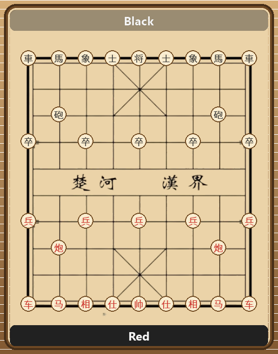

# Xiangqi Engine

A fully-featured Xiangqi (Chinese Chess) engine implemented in Python. The project features a complete rule generator, advanced heuristic evaluations, an integrated arena for bot battles, and a graphical user interface (GUI). 



## Overview

The engine serves as both a playable application and a framework for AI bot development in Xiangqi. It adheres to all standard rules, including complex edge cases such as the flying general rule and various draw conditions. 

### Key Capabilities

*   **Move Generation & Validation**: Full rule enforcement, including check, checkmate, stalemate detection, and repetition rules.
*   **Search Algorithms**: Utilizes Negamax with Alpha-Beta pruning, enhanced by Iterative Deepening Search (IDS).
*   **Search Enhancements**: Implements Quiescence Search to mitigate the horizon effect, Transposition Tables (via Zobrist Hashing) for state caching, and Move Ordering (MVV-LVA, Killer Moves) for faster alpha-beta cutoffs.
*   **Evaluation Function**: A comprehensive linear heuristic evaluator that considers material advantage, piece-square tables, mobility, pawn structures, and king safety.
*   **Opening Book**: Integrated standard opening lines.
*   **Bot Arena**: Automated framework to run bot-versus-bot matches, complete with PGN exports and detailed structured logging.
*   **UCCI Protocol**: Provides a Universal Chinese Chess Protocol (UCCI) interface to connect with standard GUI hosts.

## Project Structure

The codebase is organized modularly to separate core logic, AI agents, and interface layers:

*   `src/main.py`: Application entry point.
*   `src/core/`: Board representation, move generation, and game rules.
*   `src/bots/`: AI agent definitions and engine logic (search, evaluation).
*   `src/arena/`: Matchmaking, automated game loops, and logging.
*   `src/gui/`: Pygame-based graphical user interface.
*   `src/ucci/`: UCCI protocol adapter for external integration.
*   `src/tests/`: Unit test suite ensuring logic correctness.

## Requirements

*   Python 3.12 or higher.
*   Dependencies: `numpy`, `scipy`, `networkx`, `pygame`, `colorama`.

## Installation

Clone the repository and install the required packages. Using `uv` is recommended for dependency management:

```bash
git clone <repository_url>
cd INT3401E-2-project

# Install via uv
uv sync

# Or using standard pip
pip install -r requirements.txt
```

## Usage

### Interactive Game (GUI / CLI)

Run the application module to launch the interactive prompt:

```bash
cd src
python main.py
```

You can choose to play as a human against an AI bot, or watch two bots compete. The game can be rendered in the terminal (CLI mode) or via the Pygame graphical interface. Match logs and PGN files are saved in the `logs/` directory.

### UCCI Mode

To use the engine as a backend for standard Xiangqi GUIs (such as WinBoard or Pengfei), start the engine in UCCI mode:

```bash
python main.py --ucci
```

### Benchmarks

The project includes built-in benchmarking tools to measure the performance of the move generator and the search engine.

*   **Search Benchmark**: Measures nodes per second (NPS) and alpha-beta pruning efficiency.
    ```bash
    python main.py --bench
    ```
*   **Perft Benchmark**: Validates the correct number of leaf nodes generated at various depths to ensure rule engine accuracy.
    ```bash
    python main.py --perft
    ```

## Documentation

Detailed methodology and reporting on the engine's design can be found in the `docs/` directory.

## License

This project is licensed under the MIT License. See the `LICENSE` file for full details.
